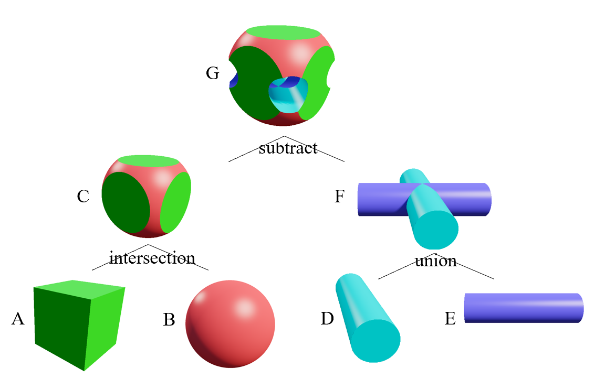
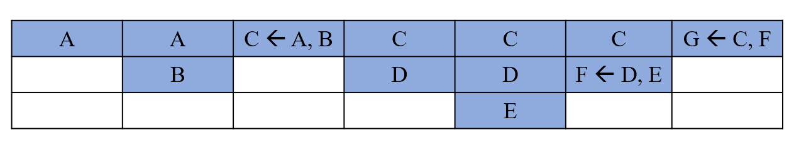
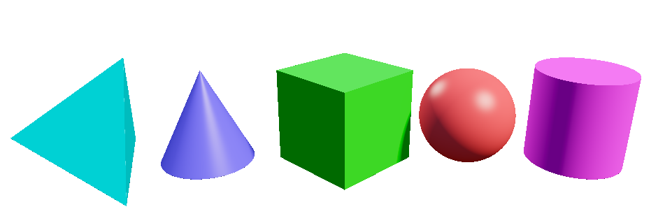
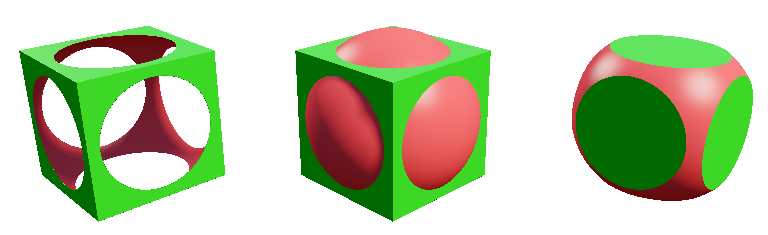
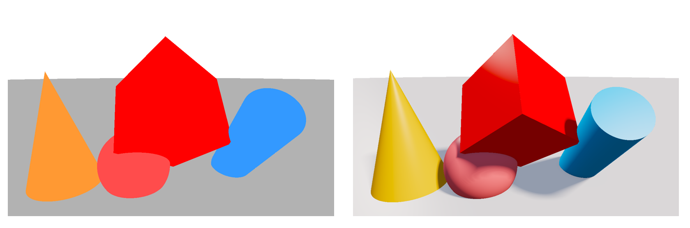
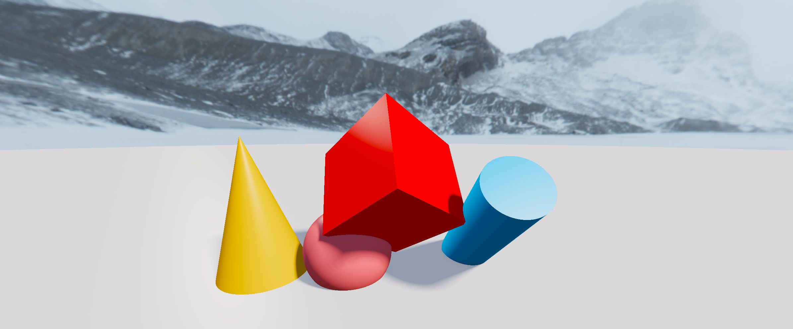
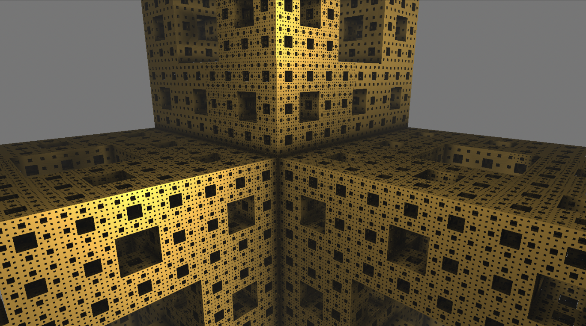
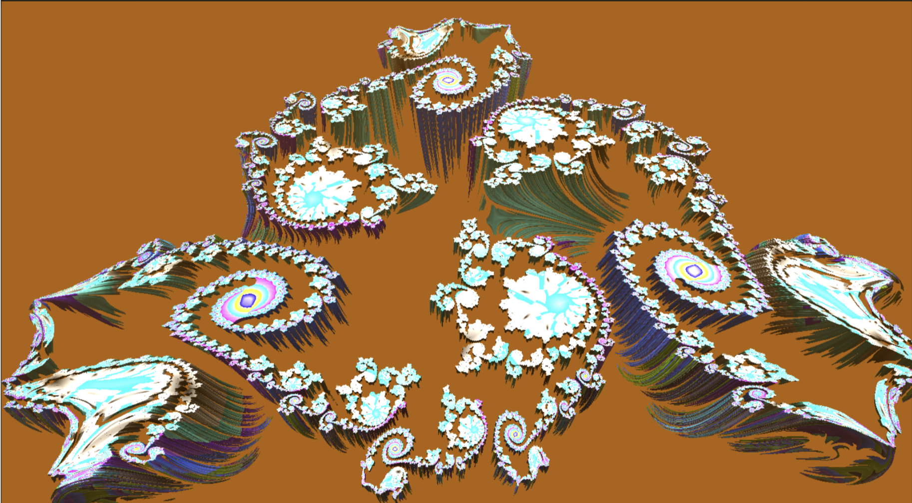

# ISR:  Implicit Surface Rendering

Authors: [Shuo Wu](https://github.com/xunying123), [Songlin Jiang](https://github.com/clorf6), [Guanjie Wang](https://github.com/Irfnfnkemed).

- source code: [ISR](https://github.com/xunying123/ISR)

## Technical Approach
### SDF
Signed Distance Functions (SDFs) are the cornerstone of our rendering approach, enabling us to define complex implicit geometries with remarkable precision and efficiency. Unlike traditional ray tracers that rely on explicit ray-primitive intersection tests, which can be computationally expensive, SDFs provide a powerful alternative. Each SDF returns the shortest distance from any point in space to the surface of an object, allowing us to determine intersections with minimal computational effort.

By leveraging SDFs, we can render highly detailed geometries at a fraction of the cost compared to traditional methods. Instead of performing millions of triangle intersection tests, our ray marcher only needs to evaluate the SDF once per step along the ray. This efficiency makes ray marching an ideal technique for real-time rendering and complex scene generation.

SDFs offer several unique and interesting properties that make them particularly well-suited for our tasks:
* Union, Intersection, and Subtraction: We can combine different shapes using these operations to create more complex geometries.
* Infinite Repetition: Using modulo operations, we can create infinitely repeating patterns.
* Reflection and Symmetry: Shapes can be mirrored across different planes to generate symmetrical structures.　

For example, the following demonstrates the SDF function of the cubiod and union operation.
```glsl
float sdfCuboid(vec3 p, vec3 c, vec3 b)
{
    // calculate the SDF from p to the cuboid
    // c is the centre point of cuboid and b is the vector with half edge length
    vec3 q = abs(p - c) - b;
    return length(max(q, 0.0)) + min(max(q.x, max(q.y, q.z)), 0.0);
}

float sdfUnion(vec3 p, object obj1, object obj2)
{
    // calculate the SDF from p to the the union of obj1 and obj2
    return min(obj1.sdf(p), obj2.sdf(p));
}
```

### CSG tree
We use constructive solid geometry tree (CSG tree) to build the complex objects in our project. This technique uses boolean operations (union, intersection, and subtraction) to combine simple shapes into more complex ones. By representing these operations in a tree structure, we can efficiently manage and evaluate the resulting geometries. Each node in the CSG tree represents a shape or an operation, and the tree structure allows us to recursively combine shapes to create intricate models. SDFs are particularly well-suited for CSG operations because they can be easily combined using mathematical operations. Here is an example of how CSG tree works:
<div style="text-align: center;">
    
</div>

In the actual GPU rendering implementation, we utilize texture memory to store the CSG tree. To avoid recursive calls, which are inefficient and prone to stack overflow in GPU rendering, we store the nodes of the CSG tree in the order of a post-order traversal. This way, we can sequentially traverse all nodes during the SDF computation. Thanks to the post-order traversal order, we only need a stack of length 3 to traverse the entire tree and obtain the final SDF. This significantly reduces the overhead. Here's the example of the processing stack of the former example.

<div style="text-align: center;">
	
</div>

### Environment lights

- **Hemispheric Ambient**: this technique creates a bright top and a dark bottom, simulating the natural effect of ambient light coming from the sky and the ground. It helps to establish a basic lighting environment that enhances the overall scene.

- **Key Light and Fill Light**: The key light is used to illuminate the main subject and create shadows, defining the primary light direction and shape. The fill light, on the other hand, is used to "soften" the shadows and brighten the darker areas, ensuring that the contrast is not too harsh and maintaining detail in the shadowed regions.

- **Soft-shadow**: Unlike hard shadows, which have sharp edges, soft shadows have gradual transitions, making them more natural and visually appealing. 

- **Screen-Space Ambient Occlusion**:  In the object seams, folding corner automatic dark, enhance the three-dimensional sense

- **Blinn-Phong**: Fast, numerically friendly specular highlight approximation

- **ACES, Exposure, Saturation, sRGB**: Make the light more realistic

## Preliminary results

### Basic shapes
The following shows the result of rendering basic shapes, including sphere, cone, cylinder, cuboid, and arbitrary  tetrahedron.
Thanks to the expressiveness of signed distance functions (SDFs), all primitives inherently support arbitrary **size**, **orientation**, and **placement** in 3D space.
On top of that, we implemented a unified interface for applying **translation**, **rotation**, and **scaling** transformations to individual objects.

<div style="text-align: center;">
	
</div>

### Union, Intersection, and Subtraction

The below shows the result of union, intersection, and subtraction operations.

<div style="text-align: center;">
	
</div>

### Brightness and Environment light

We handle the brightness of the object according to its normal directions. Currently we only support the Lambertian material. Also we add the environment light and the soft-shadow. Here is a comparison of the rendering results with and without the above-mentioned processing.

<div style="text-align: center;">
	
</div>

### Background texture

We also set the background texture. We load the texture to the GPU texture-memory. Here is an example.

<div style="text-align: center;">
	
</div>
## The next plan

Our immediate focus is to **enhance realism and material variety**. Based on the current SDF-based renderer, we plan to support more materials, including:

- **Metal and Glass shaders**

- **Reflection and Refraction**

- **Fresnel effects**

This will provide the foundation for richer visual quality and prepare the system for physically-plausible rendering. After that, we set out three alternative directions for further development:

- **Implementing fractals and infinite structures(main)**：We plan to support mathematically defined complex geometries such as **fractal objects** (never-ending patterns based on mathematical equations, e.g. Menger Sponge, Mandelbulb, Julia set). These are ideal use cases for signed distance fields due to their recursive nature and self-similarity.

<div style="text-align: center;">
	
</div>

<div style="text-align: center;">
	
</div>
​	Techniques involved: Recursive or loop-based GLSL SDFs or Distance Estimation for Fractals, LOD(Level Of Details) / Adaptive Iteration, Orbit trapping, Smooth Interpolation for Discrete Iteration…

- **Building interactive UI and object manipulation**: We aim to implement a basic desktop GUI system that allows users to **rotate/zoom the camera** and **interactively add or manipulate objects** in the scene. This will transform the renderer from a static tool into an interactive modeling environment. 
- **Improving ray marching efficiency**: Ray marching performance is currently limited by unnecessary steps in empty space and deep recursion for complex scenes. We will integrate basic optimization techniques to improve both **frame rate and step efficiency**, making our renderer more scalable.

## Credit

SJTU Course CS3962-01: Computer Graphics (2025 Spring).

This page is maintained by [Shuo Wu](https://github.com/xunying123), [Songlin Jiang](https://github.com/clorf6), [Guanjie Wang](https://github.com/Irfnfnkemed).